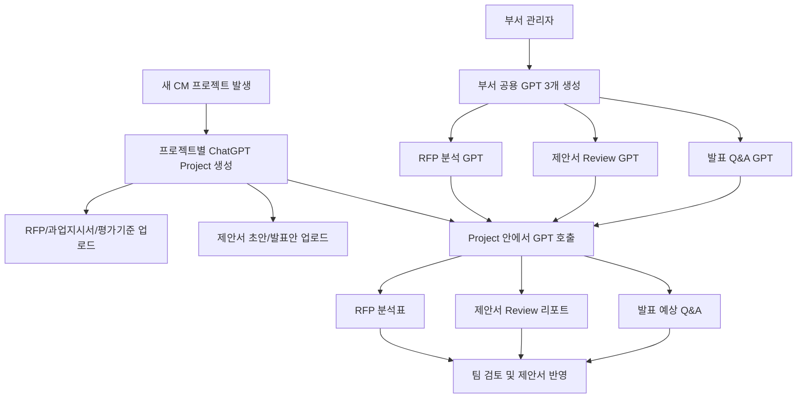

# 삼우씨엠 전략사업그룹 ChatGPT 실행 가이드북

작성 기준일: 2026-04-30  
적용 대상: CM 용역 기술제안서 업무 자동화  
대상 사용자: ChatGPT를 처음 사용하는 전략사업그룹 팀원, PM, 부서 관리자

---

## 1. 이 가이드북의 결론

전략사업그룹의 CM 제안 업무는 다음 방식으로 운영하는 것을 권장합니다.

```text
부서 공용 GPT 3개 = 반복 업무용 전문가
프로젝트별 ChatGPT Project = 실제 프로젝트 자료실과 협업 작업방
Codex 또는 Claude Code = PM/관리자용 보조 자동화 도구
```

즉, 매번 새 프로젝트가 생길 때마다 GPT를 새로 만드는 것이 아닙니다.  
부서 공용 GPT 3개는 한 번 만들어 계속 사용하고, 실제 RFP와 제안서 파일은 프로젝트별 ChatGPT Project에 올려서 운영합니다.

부서 공용 GPT 3개:

1. `삼우CM RFP 분석 GPT`
2. `삼우CM 제안서 Review GPT`
3. `삼우CM 발표 Q&A GPT`

프로젝트별 Project 예시:

```text
2605_발주처A_본관재건축_CM제안
2606_발주처B_복합개발_CM제안
2607_발주처C_업무시설신축_CM제안
```

가장 중요한 운영 원칙은 다음입니다.

```text
GPT는 부서 공통 전문가이고,
Project는 해당 프로젝트의 자료와 대화가 쌓이는 실제 작업 공간이다.
```

---

## 2. GPT와 Project의 차이

처음 사용하는 사람이 가장 많이 헷갈리는 부분입니다.

### 2.1 GPT란?

GPT는 특정 업무를 잘하도록 미리 설정한 ChatGPT입니다.

예를 들어 `삼우CM RFP 분석 GPT`는 다음을 기억하도록 설정합니다.

- RFP를 요약만 하지 말 것
- OCR 품질을 먼저 확인할 것
- 필수조건, 감점요소, 평가배점, 제출조건을 표로 정리할 것
- RFP 과업내용을 제안서 개선전략으로 바꿀 것
- 불확실한 내용은 추정하지 말고 `확인 필요`로 표시할 것

GPT에는 `Instructions`, `Conversation starters`, `Knowledge`, `Capabilities`를 설정할 수 있습니다. OpenAI 공식 도움말에서도 GPT는 특정 목적에 맞게 구성된 ChatGPT이며, 지침, 대화 시작 예시, 지식 파일, 기능 등을 포함할 수 있다고 설명합니다.  
참고: [GPTs in ChatGPT](https://help.openai.com/en/articles/8554407)

### 2.2 Project란?

Project는 하나의 실제 프로젝트를 위한 작업방입니다.

Project 안에는 다음이 들어갑니다.

- RFP
- 과업지시서
- 평가 및 업체 선정 기준
- 입찰공고문
- 현장조사 자료
- KOM 자료
- 제안서 초안
- 발표자료
- 예상 Q&A
- AI와 나눈 대화
- 프로젝트별 지침

OpenAI 공식 도움말 기준으로 Project는 장기 작업을 한 곳에 모아두는 작업공간이며, 파일, 지침, 채팅을 함께 보관해 ChatGPT가 해당 업무 맥락을 유지하도록 돕습니다.  
참고: [Projects in ChatGPT](https://help.openai.com/en/articles/10169521)

### 2.3 GPT와 Project의 관계

GPT와 Project는 같은 것이 아닙니다.

실무적으로는 이렇게 이해하면 됩니다.

| 구분 | GPT | Project |
|---|---|---|
| 역할 | 반복 업무용 전문가 | 프로젝트별 자료실/작업방 |
| 생성 빈도 | 부서에서 3개 정도 만들고 계속 사용 | 프로젝트마다 1개 생성 |
| 들어가는 자료 | 매뉴얼, 표준 템플릿, 공통 지침 | 해당 프로젝트 RFP, 제안서, 발표안 |
| 공유 목적 | 팀 전체가 같은 기준으로 AI를 쓰게 함 | 해당 프로젝트 팀이 같은 자료와 결과를 공유 |
| 결과물 관리 | 사용자의 개별 채팅에 남음 | 프로젝트 안의 채팅/파일로 남음 |

중요한 공식 동작:

- 기존 Project 채팅 안에서 Custom GPT를 사용할 수 있습니다.
- 단, 첫 메시지를 Custom GPT에서 시작하면 그 대화는 Project 밖에서 시작될 수 있습니다.
- 따라서 실무에서는 반드시 `Project를 먼저 열고`, 그 안에서 새 채팅을 만든 뒤 GPT를 호출하는 방식이 좋습니다.

참고: [Projects in ChatGPT - Can I use a custom GPT in a project?](https://help.openai.com/en/articles/10169521)

---

## 3. 권장 운영 구조

### 3.1 전체 구조



### 3.2 누가 무엇을 관리하나?

| 역할 | 담당 업무 |
|---|---|
| 부서 관리자 | GPT 3개 생성, 지침 업데이트, 권한 관리, 파일럿 평가 |
| 프로젝트 PM | 프로젝트별 Project 생성, 자료 업로드, 산출물 관리 |
| 제안서 담당자 | RFP 분석 결과 확인, 제안서 초안 작성, Review 반영 |
| 기술지원 담당자 | 기술지원 요청 Item 확인, 공법/원가/일정/안전 검토 |
| 발표 담당자 | Q&A 생성, 답변 보완, 리허설 기록 |

---

## 4. 사전 준비

### 4.1 권장 플랜

가능하면 `ChatGPT Business` 워크스페이스를 권장합니다.

이유:

- 부서원 10~12명이 같은 워크스페이스에서 사용 가능
- GPT를 팀 내부에 공유 가능
- Project 공유를 통해 프로젝트별 파일과 채팅을 함께 관리 가능
- Business 데이터는 기본적으로 모델 학습에 사용되지 않음
- 각 사용자의 개인 채팅은 자동으로 다른 팀원에게 공개되지 않음

OpenAI 공식 도움말에 따르면 ChatGPT Business 워크스페이스 데이터는 기본적으로 학습에 사용되지 않고, 사용자별 채팅 기록은 자동으로 다른 구성원에게 보이지 않습니다.  
참고: [Managing data, sharing, and privacy in ChatGPT Business](https://help.openai.com/en/articles/8798634)

### 4.2 계정과 권한

부서 운영을 시작하기 전에 아래를 정합니다.

| 항목 | 권장 설정 |
|---|---|
| Workspace Owner | 부서장 또는 지정 관리자 |
| GPT 관리자 | 전략사업그룹 PM 1~2명 |
| Project 생성 권한 | 각 프로젝트 PM |
| Project 편집 권한 | PM, 핵심 작성자 |
| Project 채팅 권한 | 참여 팀원 |
| 외부 공유 | 원칙적으로 금지 |

### 4.3 자료 보안 원칙

1. 개인 Plus/Pro 계정보다 Business 워크스페이스 사용을 우선합니다.
2. Project 공유 범위는 해당 프로젝트 참여자만으로 제한합니다.
3. 외부 협력사 자료, 발주처 비공개 자료, 개인정보가 포함된 파일은 업로드 전 PM이 확인합니다.
4. AI 결과물은 참고자료이며, 최종 제출 전 담당자가 원문 대조를 해야 합니다.
5. `확인 필요`, `원문 확인 필요`, `OCR 불완전`으로 표시된 항목은 제안서에 바로 반영하지 않습니다.

---

## 5. 부서 공용 GPT 3개 만들기

부서 공용 GPT는 한 번 만들어 두고 계속 씁니다.  
프로젝트가 100건 이상 진행되어도 GPT를 매번 새로 만들 필요는 없습니다.

### 5.1 GPT 만들기 공통 절차

1. ChatGPT에 로그인합니다.
2. 왼쪽 메뉴 또는 GPTs 화면에서 `Create` 또는 `만들기`를 선택합니다.
3. `Configure` 화면에서 이름, 설명, 지침, 대화 시작 문구를 입력합니다.
4. `Instructions`에는 이 패키지의 v2 지침 파일 내용을 붙여 넣습니다.
5. `Knowledge`에는 부서 공통 자료만 올립니다.
6. Preview에서 테스트합니다.
7. 저장 후 부서 워크스페이스에 공유합니다.

GPT 생성과 편집은 유료 구독 또는 워크스페이스 권한이 필요할 수 있습니다. 공식 도움말에 따르면 GPT는 ChatGPT 안에서 만들고, 테스트한 뒤 저장할 수 있습니다.  
참고: [GPTs in ChatGPT](https://help.openai.com/en/articles/8554407)

### 5.2 GPT에 올릴 자료와 올리지 않을 자료

GPT의 `Knowledge`에는 부서 공통 자료만 넣습니다.

넣어도 되는 자료:

- 기술제안서 작성 절차서 매뉴얼
- 표준 RFP 분석표 양식
- 표준 제안서 Review 리포트 양식
- 표준 발표 Q&A 양식
- 부서 공통 운영 지침

넣지 않는 것이 좋은 자료:

- 특정 프로젝트의 RFP 전체
- 특정 발주처의 미공개 평가자료
- 작성 중인 제안서 원문
- 협력사 견적, 내부 단가, 개인정보 포함 파일

이런 프로젝트별 자료는 GPT가 아니라 해당 프로젝트의 Project에 올립니다.

### 5.3 GPT 1: 삼우CM RFP 분석 GPT

설정 파일:

```text
ai_automation_package/gpt_instructions/rfp_analysis_gpt_v2.md
```

권장 이름:

```text
삼우CM RFP 분석 GPT
```

설명:

```text
CM 용역 RFP, 과업지시서, 평가기준을 분석해 필수조건, 감점요소, 평가배점 대응 Matrix, 과업내용-개선사항 매핑표를 작성하는 부서 공용 GPT입니다.
```

Conversation starters:

```text
업로드한 RFP와 평가기준의 OCR 품질을 먼저 확인하고, 분석 가능 여부를 판단해줘.
```

```text
필수 제출조건, 감점요소, 평가항목, 배점, 인터뷰 관련 조건을 표로 정리해줘.
```

```text
RFP 과업내용을 제안서에 들어갈 개선전략으로 변환해줘.
```

필수 산출물:

- 자료 품질/OCR 점검표
- RFP 필수조건/감점요소 표
- 평가배점 대응 Matrix
- RFP 과업내용-개선사항 매핑표
- 4대 특성 분석
- 기술지원 요청 Item 초안

### 5.4 GPT 2: 삼우CM 제안서 Review GPT

설정 파일:

```text
ai_automation_package/gpt_instructions/proposal_review_gpt_v2.md
```

권장 이름:

```text
삼우CM 제안서 Review GPT
```

설명:

```text
CM 기술제안서 초안을 RFP와 평가기준 기준으로 검토하고, 누락/감점 위험, 배점 대응 부족, 일반론 문장, 정량화 부족을 찾아 수정 방향을 제안하는 부서 공용 GPT입니다.
```

Conversation starters:

```text
제안서 초안을 평가배점 대응 관점에서 검토해줘.
```

```text
RFP 필수조건과 과업내용 중 제안서에 빠진 항목을 찾아줘.
```

```text
일반론 문장을 프로젝트 특화 문장으로 고칠 수 있게 수정 예시를 작성해줘.
```

필수 산출물:

- 제안서 Review 리포트
- 배점 Coverage 표
- RFP 과업 대응표
- P0/P1/P2/P3 우선순위 수정 목록
- 일반론 문장 개선안
- 원가/VE/공법/Change/Claim 보완안

### 5.5 GPT 3: 삼우CM 발표 Q&A GPT

설정 파일:

```text
ai_automation_package/gpt_instructions/presentation_qa_gpt_v2.md
```

권장 이름:

```text
삼우CM 발표 Q&A GPT
```

설명:

```text
CM 제안서, RFP, 평가기준, 발표안을 기준으로 예상 질문, 압박 질문, 3x3 키워드 Sheet, 4-Step 모범답안을 생성하는 부서 공용 GPT입니다.
```

Conversation starters:

```text
평가항목별 발표 예상 질문을 40개 만들어줘.
```

```text
제안서의 약점에서 나올 수 있는 압박 질문과 답변 키워드를 만들어줘.
```

```text
각 질문별로 3x3 키워드와 4-Step 답변을 작성해줘.
```

필수 산출물:

- 평가항목 기반 예상질문
- 압박 질문
- 3x3 키워드 Sheet
- 4-Step 모범답안
- 리허설용 꼬리질문

### 5.6 GPT 공유

GPT를 만든 뒤에는 부서원에게 공유합니다.

권장 권한:

| 대상 | 권한 |
|---|---|
| 일반 팀원 | Can chat |
| PM | Can chat 또는 Can view settings |
| GPT 관리자 | Can edit |

주의할 점:

- GPT를 공유해도 GPT 제작자가 팀원들의 개별 GPT 대화를 자동으로 볼 수 있는 것은 아닙니다.
- PM이 결과물을 함께 봐야 한다면 반드시 Project 안에서 작업하게 해야 합니다.
- Project 밖에서 각자 GPT를 쓰면 결과물이 개인 채팅에 흩어집니다.

OpenAI 공식 도움말에서도 GPT 제작자는 사용자가 해당 GPT와 나눈 개별 대화를 볼 수 없다고 안내합니다.  
참고: [GPTs in ChatGPT](https://help.openai.com/en/articles/8554407)

---

## 6. 프로젝트별 ChatGPT Project 만들기

### 6.1 Project 생성 시점

다음 자료 중 하나라도 확보되면 Project를 만듭니다.

- 입찰공고문
- RFP
- 제안요청서
- 과업지시서
- 평가 및 업체 선정 기준

늦어도 KOM 전에는 Project를 만들어야 합니다.

### 6.2 Project 이름 규칙

권장 형식:

```text
YYMM_발주처_사업명_CM제안
```

예시:

```text
2605_발주처A_본관재건축_CM제안
2606_발주처B_복합개발_CM제안
2607_발주처C_업무시설신축_CM제안
```

### 6.3 Project 지침 입력

Project를 만든 뒤 `Project settings`에서 지침을 입력합니다.

사용할 파일:

```text
ai_automation_package/project_templates/chatgpt_project_template_v2.md
```

Project 지침에는 다음 내용이 반드시 들어가야 합니다.

- 이 Project는 특정 CM 제안 프로젝트 전용이라는 점
- 답변 시 업로드된 RFP와 평가기준을 우선 근거로 삼을 것
- OCR 품질이 낮으면 확정 분석하지 말 것
- 모든 산출물은 표 형태로 정리할 것
- 불확실한 항목은 `확인 필요`로 표시할 것
- 제안서 초안은 평가배점 대응 관점에서 검토할 것
- Q&A는 평가항목과 약점 중심으로 생성할 것

### 6.4 Project에 업로드할 파일

처음 업로드할 자료:

| 구분 | 파일 |
|---|---|
| 입찰자료 | 입찰공고문 |
| 핵심자료 | RFP 또는 제안요청서 |
| 핵심자료 | 과업지시서 |
| 핵심자료 | 평가 및 업체 선정 기준 |
| 보조자료 | 현장설명회 자료 |
| 보조자료 | 현장조사 자료 |
| 보조자료 | 질의응답 회신 |

진행 중 추가 업로드할 자료:

| 단계 | 파일 |
|---|---|
| KOM 전 | RFP 분석표, KOM 회의록 |
| 초안 작성 후 | 제안서 초안 PDF 또는 PPT |
| Review 후 | 수정 제안서, Review 반영표 |
| 발표 준비 | 발표자료, 발표 스크립트 |
| 종료 후 | 실제 심사 질문, Lessons Learned |

Project 파일 업로드 한도는 플랜에 따라 다릅니다. 공식 도움말 기준으로 Business, Enterprise, Edu, Pro는 Project당 40개 파일을 지원하며, 한 번에 업로드할 수 있는 파일은 10개입니다.  
참고: [Projects in ChatGPT - Plans and limits](https://help.openai.com/en/articles/10169521)

### 6.5 파일 이름 규칙

파일명은 ChatGPT가 구분하기 쉽게 만듭니다.

권장:

```text
01_입찰공고문.pdf
02_RFP_제안요청서.pdf
03_과업지시서.pdf
04_평가기준.pdf
05_현장조사.pdf
06_제안서초안_v1.pdf
07_제안서초안_v2.pdf
08_발표자료_v1.pdf
09_실제심사질문_기록.md
```

피해야 할 이름:

```text
최종.pdf
최종최종.pdf
진짜최종.pdf
제안서.pdf
자료.pdf
```

### 6.6 Project 공유 권한

Project를 공유할 때 권한을 나눕니다.

| 대상 | 권장 권한 | 이유 |
|---|---|---|
| PM | Edit | 파일 업로드, 지침 수정, 멤버 관리 필요 |
| 핵심 작성자 | Edit | 초안과 보완자료 업로드 필요 |
| 기술지원 담당자 | Chat | 분석 결과 확인과 질의응답 가능 |
| 발표자 | Chat | Q&A 생성과 리허설 가능 |
| 참조자 | Chat | 자료 확인 중심 |

공식 도움말 기준으로 Project는 공유 시 `Edit`와 `Chat` 권한을 줄 수 있습니다. Edit 권한은 지침/파일 수정이 가능하고, Chat 권한은 프로젝트의 채팅, 파일, 지침을 보고 대화할 수 있습니다.  
참고: [Projects in ChatGPT - Share a Project](https://help.openai.com/en/articles/10169521)

---

## 7. GPT와 Project를 함께 쓰는 방법

### 7.1 가장 중요한 규칙

반드시 Project 안에서 먼저 새 채팅을 만듭니다.  
그 다음 필요한 GPT를 호출합니다.

권장 순서:

```text
1. ChatGPT 왼쪽 메뉴에서 해당 Project 클릭
2. Project 안에서 New chat 클릭
3. 첫 메시지에서 작업 목적 입력
4. 필요 시 @삼우CM RFP 분석 GPT 처럼 Custom GPT 호출
5. 결과물을 Project 채팅에 남김
```

이유:

- Project 안에서 작업해야 해당 프로젝트 파일과 지침을 사용할 수 있습니다.
- Project 안에 대화가 남아야 팀원이 볼 수 있습니다.
- GPT를 바깥에서 먼저 열면 결과물이 개인 채팅에 남아 흩어질 수 있습니다.

### 7.2 올바른 사용 예시

```text
Project: 2605_발주처A_본관재건축_CM제안
Chat: 01_RFP_필수조건_감점요소

@삼우CM RFP 분석 GPT
이 Project에 업로드된 입찰공고문, RFP, 과업지시서, 평가기준을 기준으로
자료 품질/OCR 상태를 먼저 확인하고,
필수조건, 감점요소, 평가배점, 제출조건을 표로 정리해줘.
근거 파일명과 원문 위치를 함께 표시하고,
불확실한 항목은 확인 필요로 표시해줘.
```

### 7.3 피해야 할 사용 예시

```text
1. GPTs 메뉴에서 삼우CM RFP 분석 GPT를 먼저 연다.
2. 그곳에 프로젝트 RFP를 업로드한다.
3. 분석 결과를 받는다.
4. 나중에 PM에게 따로 전달한다.
```

이 방식은 추천하지 않습니다.

문제점:

- 결과물이 Project에 남지 않습니다.
- 다른 팀원이 같은 맥락을 이어받기 어렵습니다.
- PM이 산출물 이력을 확인하기 어렵습니다.
- 프로젝트별 파일과 GPT 개인 업로드가 섞입니다.

### 7.4 만약 GPT가 Project 안에서 잘 호출되지 않는 경우

UI나 권한에 따라 Custom GPT 호출 방식이 다르게 보일 수 있습니다. 그럴 때는 다음 중 하나로 처리합니다.

1. Project 채팅 안에서 `@`를 입력해 GPT 이름을 검색합니다.
2. GPT 호출이 안 되면 Project 채팅에 v2 지침의 핵심 프롬프트를 직접 붙여 넣습니다.
3. GPT에서 받은 결과를 Project로 옮겨야 할 경우, 해당 채팅을 Project로 이동하거나 결과물을 Project 채팅에 붙여 넣습니다.

단, 새 프로젝트 운영에서는 처음부터 Project 안에서 작업하는 것을 기본으로 합니다.

---

## 8. 실제 프로젝트 운영 절차

### 8.1 전체 단계

```text
00_자료품질_OCR_확인
01_RFP_필수조건_감점요소
02_평가배점_대응전략
03_RFP과업_개선사항_매핑
04_4대특성_KOM_요약
05_기술지원_요청서
06_제안서_1차_Review
07_제안서_2차_Review
08_발표_QA_키워드
09_리허설_압박질문
10_최종체크_PRM
11_사후평가_Lessons_Learned
```

각 항목은 Project 안에서 별도 채팅으로 만듭니다.

### 8.2 00_자료품질_OCR_확인

목적:

- PDF 텍스트가 제대로 읽히는지 확인
- RFP, 평가기준, 과업지시서 누락 여부 확인
- 스캔본/OCR 필요 여부 확인

사용 GPT:

```text
삼우CM RFP 분석 GPT
```

프롬프트:

```text
이 Project에 업로드된 모든 파일을 기준으로 자료 품질을 먼저 점검해줘.

다음 표로 정리해줘.
1. 파일명
2. 문서 종류
3. 텍스트 인식 가능 여부
4. 표/배점 추출 가능 여부
5. RFP 분석에 필요한 핵심 파일 여부
6. 누락 또는 재업로드 필요 여부
7. 확인 필요 사항

텍스트 추출이 불완전한 파일은 확정 분석하지 말고 OCR 또는 원문 확인 필요로 표시해줘.
```

완료 기준:

- 필수 파일 누락 여부 확인
- OCR 문제 파일 확인
- 분석 가능한 자료와 불가능한 자료 구분

### 8.3 01_RFP_필수조건_감점요소

목적:

- 제출조건, 자격조건, 필수 포함사항, 감점요소 확인

사용 GPT:

```text
삼우CM RFP 분석 GPT
```

프롬프트:

```text
업로드된 입찰공고문, RFP, 과업지시서, 평가기준을 기준으로
필수조건과 감점요소를 정리해줘.

아래 표로 작성해줘.
1. 구분
2. 원문 요지
3. 근거 파일
4. 원문 위치 또는 페이지
5. 제안서 반영 필요 위치
6. 미반영 시 리스크
7. 담당자
8. 확인 필요 여부

제출 형식, 분량, 평가 제외 가능성, 감점, 실격, 발표 조건은 별도 표시해줘.
```

완료 기준:

- 실격/감점 가능 항목이 누락되지 않음
- 제안서 목차에 반영할 위치가 표시됨

### 8.4 02_평가배점_대응전략

목적:

- 평가표의 각 항목을 제안서 전략과 연결

사용 GPT:

```text
삼우CM RFP 분석 GPT
```

프롬프트:

```text
평가기준과 RFP를 기준으로 평가배점 대응 Matrix를 작성해줘.

아래 항목을 포함해줘.
1. 평가 구분
2. 세부 평가항목
3. 배점
4. 평가자가 보고 싶은 내용
5. 제안서 대응 방향
6. 필요한 정량 근거
7. 필요한 기술지원 Item
8. 예상 심사 질문
9. 우선순위

배점이 큰 항목과 발표에서 질문 가능성이 높은 항목을 따로 표시해줘.
```

완료 기준:

- 배점 높은 항목이 제안서 핵심 Item으로 전환됨
- 기술지원 요청 Item이 도출됨

### 8.5 03_RFP과업_개선사항_매핑

목적:

- RFP 과업을 그대로 반복하지 않고 제안 전략으로 변환

사용 GPT:

```text
삼우CM RFP 분석 GPT
```

프롬프트:

```text
RFP와 과업지시서의 주요 과업내용을 제안서에 들어갈 개선사항으로 변환해줘.

아래 표로 작성해줘.
1. RFP 과업내용
2. 발주자 의도
3. 일반적인 답변으로 끝날 위험
4. 삼우씨엠 제안서에 넣을 개선전략
5. 적용 가능한 수치/근거
6. 도식화 아이디어
7. 담당 기술지원 분야
8. 우선순위

특히 공정, 원가, 품질, 안전, 민원, 인허가, 설계변경, 클레임 항목을 중점 검토해줘.
```

완료 기준:

- RFP 과업이 제안서 문장과 도식으로 바뀔 수 있음
- 일반론을 줄일 수 있는 개선 포인트가 생김

### 8.6 04_4대특성_KOM_요약

목적:

- 매뉴얼의 4대 특성 기준으로 KOM 자료 준비

사용 GPT:

```text
삼우CM RFP 분석 GPT
```

프롬프트:

```text
이 프로젝트를 매뉴얼의 4대 특성 기준으로 분석해줘.

4대 특성:
1. 사업 특성
2. 시설 특성
3. 현장 특성
4. 발주자 요구 특성

각 특성별로 다음을 작성해줘.
1. 핵심 사실
2. 제안서 핵심 메시지
3. 주요 리스크
4. 차별화 Item
5. 기술지원 요청사항
6. 발표 예상 질문

KOM 회의에서 바로 사용할 수 있도록 1페이지 요약 형태로 정리해줘.
```

완료 기준:

- KOM에서 논의할 핵심 Item이 정리됨
- 기술지원 요청 방향이 명확해짐

### 8.7 05_기술지원_요청서

목적:

- 기술지원 담당자에게 요청할 내용을 구체화

사용 GPT:

```text
삼우CM RFP 분석 GPT
```

프롬프트:

```text
RFP 분석 결과와 평가배점 대응 Matrix를 기준으로 기술지원 요청서 초안을 작성해줘.

아래 표로 작성해줘.
1. 요청 분야
2. 요청 Item
3. 필요한 이유
4. RFP/평가기준 근거
5. 제안서에 반영될 위치
6. 필요한 산출물 형식
7. 요청 담당자
8. 요청 기한
9. 우선순위

기술지원 담당자가 바로 이해할 수 있도록 구체적으로 작성해줘.
```

완료 기준:

- 기술지원 요청이 추상적이지 않음
- RFP/평가기준과 연결됨

### 8.8 06_제안서_1차_Review

목적:

- 초안의 RFP 대응, 배점 대응, 누락 위험 확인

사용 GPT:

```text
삼우CM 제안서 Review GPT
```

프롬프트:

```text
업로드된 제안서 초안을 RFP, 과업지시서, 평가기준 기준으로 검토해줘.

아래 순서로 작성해줘.
1. 총평
2. 평가배점 Coverage 표
3. RFP 필수조건 누락 여부
4. 과업내용 대응 부족 항목
5. 일반론 문장과 수정 방향
6. 정량화가 부족한 항목
7. 원가/VE/공법/일정/Change/Claim 보완 필요 항목
8. P0/P1/P2/P3 우선순위 수정 목록

P0는 제출 전 반드시 수정해야 하는 항목으로 표시해줘.
```

완료 기준:

- 감점 또는 누락 위험이 확인됨
- 수정 우선순위가 정리됨

### 8.9 07_제안서_2차_Review

목적:

- 수정본의 개선 여부와 발표 리스크 확인

사용 GPT:

```text
삼우CM 제안서 Review GPT
```

프롬프트:

```text
수정된 제안서 초안을 2차 검토해줘.

1차 Review에서 지적된 항목이 반영되었는지 확인하고,
아직 남아 있는 감점 위험과 발표 질문 가능성이 높은 약점을 정리해줘.

특히 다음 항목을 중점 검토해줘.
1. 배점 높은 항목의 설득력
2. 정량 근거의 충분성
3. 발주자 의사결정 지원 방안
4. 설계변경/클레임 관리
5. 민원/안전/주변 영향 관리
6. 공법 대안 비교의 구체성
7. 발표에서 방어해야 할 약점
```

완료 기준:

- 최종 제출 전 남은 약점 확인
- 발표 Q&A 생성에 넘길 쟁점 정리

### 8.10 08_발표_QA_키워드

목적:

- 평가항목 기반 예상 질문과 답변 키워드 생성

사용 GPT:

```text
삼우CM 발표 Q&A GPT
```

프롬프트:

```text
업로드된 RFP, 평가기준, 최종 제안서, 발표안을 기준으로 발표 예상 질문을 작성해줘.

아래 항목을 포함해줘.
1. 평가항목
2. 예상 질문
3. 질문 의도
4. 답변 3x3 키워드
5. 4-Step 답변
6. 근거 페이지 또는 제안서 위치
7. 꼬리질문
8. 답변 위험도

총 40문항을 작성하되,
단순 확인 질문보다 압박 질문, 근거 질문, 대안 질문을 많이 포함해줘.
```

완료 기준:

- 발표자가 외울 키워드가 정리됨
- 평가위원 관점의 질문이 준비됨

### 8.11 09_리허설_압박질문

목적:

- 실제 발표 리허설용 질문 생성

사용 GPT:

```text
삼우CM 발표 Q&A GPT
```

프롬프트:

```text
발표 리허설용 압박 질문을 만들어줘.

조건:
1. 평가위원이 회의적으로 질문하는 톤
2. 제안서의 약점 또는 불명확한 부분을 찌르는 질문
3. 답변자가 60초 안에 답할 수 있는 모범답안 포함
4. 답변 후 추가로 나올 꼬리질문 포함
5. 질문 난이도 상/중/하 구분

총 30문항을 작성해줘.
```

완료 기준:

- 발표자가 약점 방어 연습 가능
- 답변 키워드가 60초 답변 구조로 정리됨

### 8.12 10_최종체크_PRM

목적:

- 제출 전 최종 누락 확인

사용 GPT:

```text
삼우CM 제안서 Review GPT
```

프롬프트:

```text
최종 제출 전 PRM 체크를 해줘.

검토 항목:
1. RFP 필수조건 누락
2. 제출 형식/분량/파일 조건 위반 가능성
3. 평가배점 대응 누락
4. 감점 가능 표현
5. 제안서와 발표자료 불일치
6. 수치/일정/금액의 앞뒤 불일치
7. 발주자명, 사업명, 위치, 기간 오기
8. 확인 필요로 남은 항목

표로 정리하고, 제출 전 사람이 반드시 확인해야 할 항목을 따로 표시해줘.
```

완료 기준:

- 제출 전 사람이 확인해야 할 리스트 확보
- AI가 확정할 수 없는 항목 구분

### 8.13 11_사후평가_Lessons_Learned

목적:

- 다음 프로젝트의 GPT 품질 개선

사용 GPT:

```text
삼우CM 발표 Q&A GPT 또는 제안서 Review GPT
```

프롬프트:

```text
이번 프로젝트의 실제 심사 질문과 AI 예상 질문을 비교해줘.

아래 표로 정리해줘.
1. 실제 질문
2. AI 예상 질문 포함 여부
3. 일치/부분일치/불일치
4. 놓친 이유
5. 다음 프로젝트 GPT 지침에 추가할 내용
6. 제안서 작성 단계에서 보완할 점

마지막에는 Lessons Learned 10개를 작성해줘.
```

완료 기준:

- 질문 적중률 확인
- 다음 프로젝트 운영 개선점 확보

---

## 9. 결과물 저장 방식

### 9.1 결과물은 자동으로 문서 파일이 되지 않는다

ChatGPT가 답변을 생성하면 우선 채팅에 남습니다.  
그 결과가 자동으로 엑셀, 워드, PDF 파일로 저장되는 것은 아닙니다.

따라서 PM은 중요한 결과물을 다음 중 하나로 관리해야 합니다.

1. ChatGPT의 응답을 Project 안에 저장 가능한 소스로 저장
2. 응답을 복사해 Markdown, Word, Excel 양식에 붙여 넣기
3. Project 안에서 후속 채팅이 참조하도록 산출물명을 명확히 남기기
4. 필요한 경우 Codex로 Markdown/Excel 변환

### 9.2 표준 산출물 이름

Project 안에서는 산출물 이름을 고정합니다.

```text
RFP 분석표
평가배점 대응 Matrix
RFP 과업내용-개선사항 매핑표
KOM 요약자료
기술지원 요청서
제안서 Review 리포트
발표 예상 Q&A
리허설 압박질문
PRM 최종체크
Lessons Learned
```

### 9.3 산출물 확정 기준

AI 산출물은 바로 확정하지 않습니다.

확정 절차:

```text
AI 초안 생성
담당자 원문 대조
PM 검토
기술지원 담당자 확인
제안서 반영
최종 제출 전 PRM 확인
```

---

## 10. 팀 운영 규칙

### 10.1 Project 채팅명 규칙

채팅명은 단계 번호를 붙입니다.

```text
00_자료품질_OCR_확인
01_RFP_필수조건_감점요소
02_평가배점_대응전략
03_RFP과업_개선사항_매핑
04_4대특성_KOM_요약
05_기술지원_요청서
06_제안서_1차_Review
07_제안서_2차_Review
08_발표_QA_키워드
09_리허설_압박질문
10_최종체크_PRM
11_사후평가_Lessons_Learned
```

### 10.2 누가 채팅을 시작하나?

| 채팅 | 담당 |
|---|---|
| 00~05 | PM 또는 RFP 분석 담당자 |
| 06~07 | 제안서 작성 담당자 |
| 08~09 | 발표 담당자 |
| 10 | PM |
| 11 | PM 또는 부서 관리자 |

### 10.3 반드시 지켜야 할 질문 방식

좋은 질문:

```text
업로드된 RFP와 평가기준을 기준으로 판단해줘.
근거 파일명과 원문 위치를 표시해줘.
불확실한 내용은 확인 필요로 표시해줘.
표로 정리해줘.
수정 우선순위를 P0/P1/P2/P3로 나눠줘.
```

나쁜 질문:

```text
이 제안서 어때?
잘 고쳐줘.
질문 좀 만들어줘.
요약해줘.
```

### 10.4 AI 답변 검토 원칙

1. AI가 말한 페이지 번호는 반드시 사람이 확인합니다.
2. RFP 필수조건, 제출조건, 감점요소는 원문 대조 없이 확정하지 않습니다.
3. 금액, 기간, 면적, 공정, 배점은 숫자 오류가 없는지 확인합니다.
4. AI가 만든 문장은 그대로 붙여 넣기보다 제안서 톤에 맞게 다듬습니다.
5. `확인 필요`가 남아 있는 상태로 최종 제출하지 않습니다.

---

## 11. Codex 또는 Claude Code는 어디에 쓰나?

Codex나 Claude Code는 전 직원용 기본 도구로 두기보다 PM/관리자용 보조 도구로 둡니다.

적합한 업무:

- PDF/PPT 텍스트 추출
- 프로젝트 폴더 자동 생성
- 파일명 정리
- ChatGPT 산출물을 Markdown/Excel로 변환
- 표준 템플릿 생성
- 반복 보고서 정리

부적합한 업무:

- 팀원 10~12명이 매일 직접 실행하는 업무
- 별도 설치 없이 즉시 써야 하는 업무
- 보안상 클라우드 전송이 절대 불가능한 업무

주의:

로컬에서 Codex나 Claude Code를 실행하더라도 AI 모델 호출은 클라우드로 갈 수 있습니다. 따라서 완전한 내부망 자동화 수단으로 보면 안 됩니다.

---

## 12. 파일럿 운영안

### 12.1 파일럿 대상

권장:

- 완료 프로젝트 3건
- 진행 예정 프로젝트 2건

총 5건으로 테스트합니다.

### 12.2 평가 기준

| 평가 항목 | 확인 방법 |
|---|---|
| RFP 필수조건 누락 탐지 | 사람이 만든 체크리스트와 비교 |
| 평가배점 대응 전략 품질 | PM 검토 |
| 제안서 일반론 탐지 | 작성자 검토 |
| 정량화 보완 제안 | 기술지원 담당자 검토 |
| 예상 Q&A 적중률 | 실제 심사 질문과 비교 |
| 팀원 재현성 | 같은 프롬프트로 유사 결과가 나오는지 확인 |

### 12.3 파일럿 후 개정

파일럿이 끝나면 다음 파일을 업데이트합니다.

```text
gpt_instructions/rfp_analysis_gpt_v2.md
gpt_instructions/proposal_review_gpt_v2.md
gpt_instructions/presentation_qa_gpt_v2.md
project_templates/chatgpt_project_template_v2.md
```

---

## 13. 자주 묻는 질문

### Q1. GPT와 Project가 자동으로 연동되나요?

완전히 하나로 합쳐진 기능은 아닙니다.  
GPT와 Project는 서로 다른 기능입니다.

다만 기존 Project 채팅 안에서 Custom GPT를 사용할 수 있습니다. 따라서 실무에서는 Project를 먼저 열고, 그 안에서 GPT를 호출하는 방식으로 운영합니다.

### Q2. GPT를 먼저 열고 작업한 뒤 Project로 옮기면 안 되나요?

가능은 하지만 추천하지 않습니다.  
처음부터 Project 안에서 작업해야 프로젝트 파일, 지침, 채팅 이력이 한 곳에 남습니다.

### Q3. 팀원이 GPT를 쓰면 PM이 그 대화를 볼 수 있나요?

Project 밖에서 개인적으로 GPT를 쓰면 PM은 볼 수 없습니다.  
GPT 제작자도 사용자별 개별 대화를 자동으로 볼 수 없습니다.

PM이 결과를 봐야 하는 업무는 반드시 공유 Project 안에서 진행해야 합니다.

### Q4. Project 안의 자료는 팀원 모두 볼 수 있나요?

공유 Project에 초대된 팀원은 권한에 따라 채팅과 파일을 볼 수 있습니다. 공식 도움말에 따르면 Project 구성원은 Project의 채팅과 파일을 볼 수 있고, 파일 다운로드도 가능합니다.

따라서 Project 공유 범위는 신중하게 정해야 합니다.

### Q5. Project마다 GPT를 새로 만들어야 하나요?

아닙니다.  
GPT는 부서 공용 3개를 계속 쓰고, Project만 프로젝트별로 새로 만듭니다.

### Q6. 제안서 초안을 GPT Knowledge에 올리면 되나요?

권장하지 않습니다.  
제안서 초안은 해당 프로젝트에만 필요한 자료이므로 Project에 올립니다.

GPT Knowledge에는 부서 공통 지식만 넣습니다.

### Q7. Project 파일이 40개를 넘으면 어떻게 하나요?

파일을 합치거나, 오래된 버전을 제거하거나, 프로젝트를 단계별로 나눕니다.

권장:

```text
입찰자료_통합.pdf
평가기준_통합.pdf
제안서초안_v1.pdf
제안서초안_v2.pdf
발표자료_v1.pdf
```

### Q8. AI가 작성한 표를 Excel로 받을 수 있나요?

ChatGPT에서 표를 만든 뒤 복사해 Excel에 붙여 넣을 수 있습니다.  
반복적으로 Excel 변환이 필요하면 Codex 보조 도구로 Markdown 또는 CSV 변환 스크립트를 만들 수 있습니다.

### Q9. AI가 RFP를 잘못 읽으면 어떻게 하나요?

먼저 `00_자료품질_OCR_확인`을 합니다.  
스캔 PDF나 표 추출이 불완전한 경우 OCR 처리본 또는 원문 파일을 다시 업로드해야 합니다.

AI가 확신하지 못하는 항목은 `확인 필요`로 남겨야 합니다.

### Q10. 동시에 여러 명이 같은 채팅을 편집할 수 있나요?

공동 문서처럼 실시간 동시 편집하는 방식은 아닙니다.  
공식 도움말 기준으로 공유 Project의 채팅은 branch 방식으로 이어갈 수 있습니다.

권장 방식:

- PM이 기준 채팅 생성
- 팀원이 필요한 경우 branch 또는 새 채팅 생성
- 최종 산출물은 PM이 하나로 정리

---

## 14. 첫 프로젝트 실행 체크리스트

### 관리자 체크리스트

- [ ] ChatGPT Business 워크스페이스 준비
- [ ] GPT 생성 권한 확인
- [ ] Project 생성 및 공유 권한 확인
- [ ] `삼우CM RFP 분석 GPT` 생성
- [ ] `삼우CM 제안서 Review GPT` 생성
- [ ] `삼우CM 발표 Q&A GPT` 생성
- [ ] GPT 3개를 팀원에게 공유
- [ ] 외부 공유 금지 원칙 공지

### PM 체크리스트

- [ ] Project 생성
- [ ] Project 이름 규칙 적용
- [ ] Project 지침 입력
- [ ] 입찰공고문 업로드
- [ ] RFP/제안요청서 업로드
- [ ] 과업지시서 업로드
- [ ] 평가기준 업로드
- [ ] 팀원 초대
- [ ] `00_자료품질_OCR_확인` 실행
- [ ] `01_RFP_필수조건_감점요소` 실행
- [ ] `02_평가배점_대응전략` 실행
- [ ] KOM 전 요약자료 생성

### 작성자 체크리스트

- [ ] RFP 분석표 확인
- [ ] 평가배점 대응 Matrix 확인
- [ ] 기술지원 요청 Item 반영
- [ ] 제안서 초안 업로드
- [ ] 1차 Review 실행
- [ ] 수정 후 2차 Review 실행
- [ ] PRM 최종체크 실행

### 발표자 체크리스트

- [ ] 최종 제안서 업로드
- [ ] 발표자료 업로드
- [ ] 예상 Q&A 생성
- [ ] 3x3 키워드 Sheet 생성
- [ ] 압박 질문 리허설
- [ ] 실제 심사 질문 기록

---

## 15. 권장 운영 원칙 10개

1. 프로젝트마다 Project를 하나 만든다.
2. 부서 GPT는 3개만 운영하고, 프로젝트마다 새로 만들지 않는다.
3. Project 첫 채팅은 반드시 자료 품질/OCR 확인으로 시작한다.
4. RFP 분석은 요약이 아니라 배점 대응 Matrix로 만든다.
5. 제안서 Review는 문장 첨삭보다 RFP 정합성과 감점 리스크를 먼저 본다.
6. 발표 Q&A는 제안서 장점보다 약점과 평가위원 질문 가능성에서 만든다.
7. AI 답변은 원문 근거와 함께 받는다.
8. 불확실한 항목은 `확인 필요`로 남긴다.
9. 최종 제출 전에는 사람이 RFP 원문과 대조한다.
10. 심사 후 실제 질문을 기록해 다음 프로젝트에 반영한다.

---

## 16. 참고한 공식 자료

- [GPTs in ChatGPT](https://help.openai.com/en/articles/8554407)
- [Projects in ChatGPT](https://help.openai.com/en/articles/10169521)
- [Managing data, sharing, and privacy in ChatGPT Business](https://help.openai.com/en/articles/8798634)
- [Managing GPT access in Enterprise and Edu workspaces](https://help.openai.com/en/articles/8555535)

---

## 17. 이 패키지에서 함께 사용할 파일

GPT 지침:

```text
ai_automation_package/gpt_instructions/rfp_analysis_gpt_v2.md
ai_automation_package/gpt_instructions/proposal_review_gpt_v2.md
ai_automation_package/gpt_instructions/presentation_qa_gpt_v2.md
```

Project 템플릿:

```text
ai_automation_package/project_templates/chatgpt_project_template_v2.md
ai_automation_package/project_templates/gpt_builder_setup_guide_v2.md
```

분석 보고서:

```text
ai_automation_package/analysis_reports/gpt_operation_improvement_from_cm_projects.md
ai_automation_package/analysis_reports/current_project_improvement_review.md
```

참고: 위 분석 보고서는 실제 CM 프로젝트 자료를 바탕으로 작성된 내부 검토용 문서입니다. GitHub public repo에는 원본 RFP/제안서, 텍스트 추출본, 내부 분석 보고서를 올리지 않는 것을 원칙으로 합니다.
